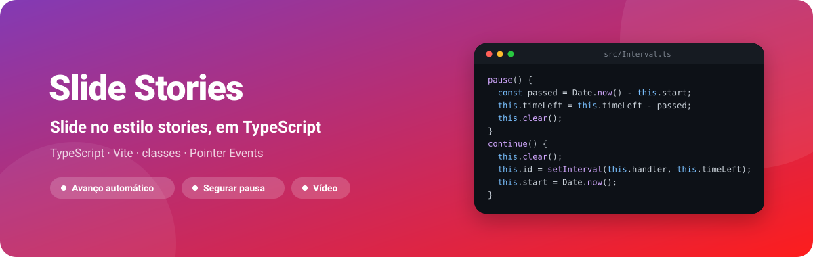
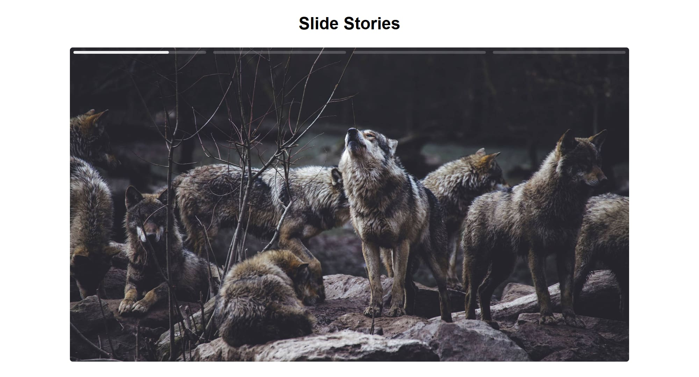
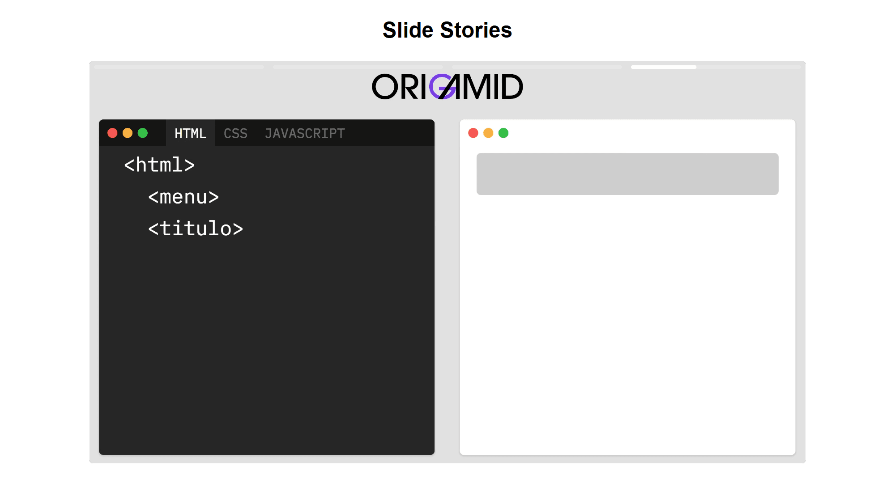
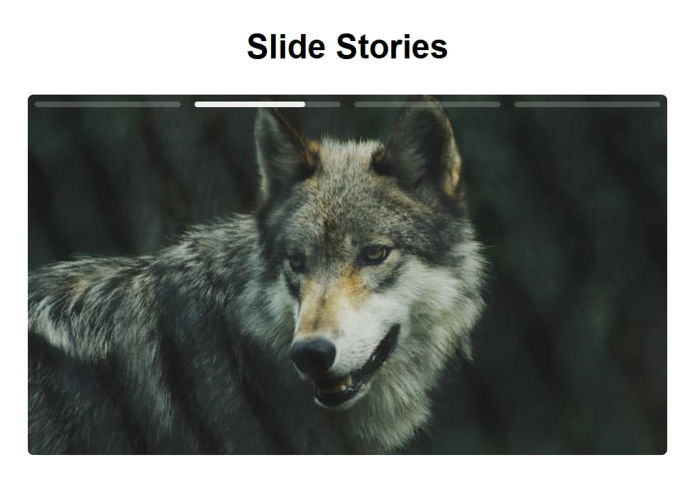

<div align="center">



**Slide no estilo stories em TypeScript: avança sozinho, pausa enquanto você segura, toca vídeo e mostra o progresso de cada item.**

[](tsconfig.json)
[](package.json)
[](https://github.com/kessleru/Stories-ts/commits/main)



</div>

## Sobre

Um componente de slide que imita os stories: três fotos e um vídeo empilhados no mesmo lugar, uma
barra por item no topo e troca automática. Foi escrito do zero em TypeScript, sem biblioteca, em
duas classes:

- **`Slide`** cuida da navegação, das barras de progresso, da pausa e do vídeo.
- **`Interval`** é um `setInterval` que sabe pausar: guarda quando começou e, ao pausar, quanto
  tempo faltava — ao continuar, retoma só com o resto.

## Telas

As capturas foram feitas com o slide **segurado**: a pausa do próprio app congela a barra de
progresso e o vídeo no ponto em que estavam.

<table>
<tr>
<td width="60%"></td>
<td width="40%"></td>
</tr>
<tr>
<td align="center"><sub><b>Vídeo — o item dura o tempo do vídeo</b></sub></td>
<td align="center"><sub><b>Celular</b></sub></td>
</tr>
</table>

## Funcionalidades

| | |
|---|---|
| ⏱️ **Avanço automático** | Cada foto fica 3 segundos (configurável no construtor) e o slide volta ao início no fim |
| 🎬 **Vídeo** | Toca mudo e sem interação; o item dura exatamente o `video.duration` |
| ✋ **Segurar para pausar** | `pointerdown` pausa barra, timer e vídeo após 200ms — um toque rápido não conta como pausa |
| 👆 **Toque para navegar** | Metade esquerda volta, metade direita avança |
| 📊 **Barras de progresso** | Uma por item, animadas com CSS; a duração da animação é a mesma do timer |
| 💾 **Retoma de onde parou** | O índice do slide atual fica no `localStorage` |

## Stack

| Camada | Ferramenta |
|---|---|
| Linguagem | [TypeScript](https://www.typescriptlang.org) com `erasableSyntaxOnly` e `verbatimModuleSyntax` |
| Build | [Vite](https://vite.dev) |
| Estilo | CSS — Grid com todos os itens na mesma área (`grid-area: 1/1`) |
| Pacotes | [pnpm](https://pnpm.io) |

## Rodando localmente

```bash
git clone https://github.com/kessleru/Stories-ts.git
cd Stories-ts
pnpm install
pnpm dev
```

O Vite sobe em `http://localhost:5173`.

### Scripts

| Comando | O que faz |
|---|---|
| `pnpm dev` | Servidor de desenvolvimento |
| `pnpm build` | `tsc` (checagem de tipos) + build de produção em `dist/` |
| `pnpm preview` | Serve o build em `http://localhost:4173` |

> **Atenção:** o GitHub Pages deste repositório publica a raiz da `main` sem build, então o
> navegador recebe o `src/main.ts` cru e o slide não carrega por lá. Para ver funcionando, rode
> localmente ou publique a pasta `dist/`.

## Estrutura

```
├── index.html          # as três fotos e o vídeo dentro de #slide-elements
└── src/
    ├── main.ts         # encontra os elementos e cria o Slide (3000ms por foto)
    ├── Slide.ts        # navegação, barras, pausa, vídeo e localStorage
    ├── Interval.ts     # setInterval com pause() e continue()
    ├── style.css
    └── assets/         # imagem_1-3.jpg e video.mp4
```

<details>
<summary><b>Regerando as imagens deste README</b></summary>

```bash
node .github/readme/gerar.mjs                 # banner.svg

pnpm build && pnpm preview                    # em outro terminal
pnpm add -D puppeteer-core sharp              # desfaça depois com git restore
node .github/readme/capturar.mjs              # segura o slide e captura em 2x
```

</details>

---

<div align="center">
<sub>Feito por <a href="https://github.com/kessleru">Otávio Kessler Ustra</a></sub>
</div>
